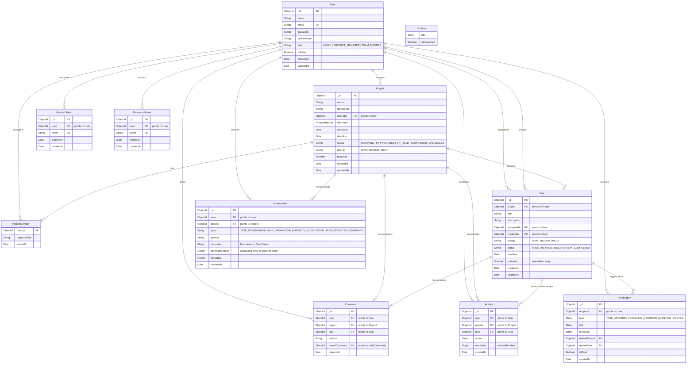

# Flowra — Entity Relationship (ER) Diagram

This document contains a text-visual representation of Flowra's MongoDB collections and their schema connections using Mermaid format.

---

## 1. ER Diagram (Mermaid)

